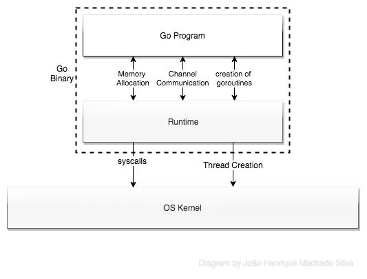

본문은 [원문](https://medium.com/the-polyglot-programmer/what-are-goroutines-and-how-do-they-actually-work-f2a734f6f991)을 바탕으로 번역하며 정리한 글입니다.

고가 유명하게 된 가장 큰 이유는 고루틴을 이용해 동시성을 매우 간단하게 다루기 때문입니다.

고루틴은 경량 스레드가 아니고, 고루틴에 대해 알아보기 앞서 OS 스레드에 대해 먼저 알아보겠습니다.

## 스레드란?

스레드는 OS 에서 작업을 수행하는 가장 작은 단위입니다. 하나의 프로세스는 여러 개의 스레드를 갖고 있습니다.

## 스레드는 프로세스 보다 가볍나요?

이론적으로 스레드는 다른 스레드와 메모리를 공유하지만, 새로운 가상 메모리 공간을 생성할 필요는 없습니다. 게다가 스레드 간의 통신은 프로세스 간의 통신보다 가볍습니다. 그 이유는 프로세스 간의 통신은 세마포어, 메시지 큐, 파이프와 같은 IPC(Inter Process Communication)을 통하기 때문입니다.

그러면 스레드가 항상 프로세스보다 좋은 성능을 보일까요? 멀티 프로세스를 사용하는 곳에선 그렇지 않습니다.

`fork()` 함수를 호출하면 파일 디스크립터, PIDs, 메모리 공간들을 공유하지 않은 채로 새로운 task 가 생성됩니다. `pthread_create()` 함수를 호출하면 앞에서 말한 것들을 공유한 채로 task 가 생성이 됩니다.

멀티 코어로 동작하는 L1 캐시 뿐만 아니라 공유 메모리에서 데이터를 Sync 하는 작업은 격리된 메모리가 격리된 다른 프로세스 간의 Sync 보다 더 비용이 큽니다.

역주: 해석하기 좀 어려웠는데, 간단하게 정리하면 멀티 코어 환경에서 Task 간 데이터를 공유할 때, 스레드와 프로세스 간의 공유 중 누가 더 비용이 크냐고 하다면 스레드 간에 이 작업이 더 비용이 크다는 것 같습니다.

> 파일 디스크립터란 리눅스 혹은 유닉스 계열 시스템에서 프로세스가 파일을 다루는 개념으로, 프로세스에서 특정 파일에 접근할 때 사용하는 추상적인 값입니다. 파일 디스크립터는 0이 아닌 정수 값을 갖습니다.
> 프로세스가 실행 중에 파일을 Open 하면 커널은 해당 프로세스의 파일 디스크립터 숫자 중 사용하지 않는 가장 작은 값을 할당하고, 프로세스는 시스템 콜을 이용해 파일에 접근할 때 파일 디스크립터 값을 이용해 접근 할 수 있습니다.
> 출처: https://twofootdog.tistory.com/51

## 그러면 어떻게 스레드의 단점을 극복할 수 있을까요?

스레드를 느리게 만드는 3가지 요인이 있습니다.

1. 스레드는 큰 스텍 사이즈를 (≥ 1MB) 갖고 있습니다. 1000 개를 스레드를 생성하면 벌써 1GB 를 사용하는 것입니다.
2. 스레드는 많은 레지스터를 복원해야 하는데, 이 일부 레지스터는 AVX, SSE, Floating Point Register, PC, SP 등이 있는데 이것들은 성능에 영향을 미칩니다.
3. 스레드를 생성하고 제거하는 작업은 OS 에게 요청해 메모리와 같은 자원을 갉아 먹습니다.

## 그러면 고루틴은 어떨까요?

고루틴은 고 언어에서 동시성을 다루기 위한 방법입니다. 고루틴은 OS 상에 존재하는 것이 아닌 Go Runtime 안에서 동작하는 가상의 공간입니다. 그래서 Go Runtime scheduler 가 이 고루틴의 생명 주기를 관리합니다.

Go Runtime 은 3개의 C struct 를 갖고 있습니다.

1. The G Struct: 한 개의 고루틴과 그 고루틴의 Stack 과 현재 상태를 관리하기 위한 필드를 표현합니다.
2. The M Struct: OS 스레드와 포인터들을 표현합니다. 이 포인터들가 가리키는 필드들은 실행 가능한 고루틴을 포함한 global queue 가 있고, 현재 실행 중인 고루틴이 있고, 자신의 캐시, 그리고 Scheduler 가 있습니다.
3. The Sched Struct: 고루틴들의 큐들을 관리하고, M Struct 나 다른 정보들을 실행하기 위해 Scheduler 를 필요로 하는 곳에 이용됩니다.

G Struct 를 포함하는 2개의 큐가 있습니다. 하나는 실행 가능한 큐로 M 의 스레드들이 작업을 더 잘 찾게 돕고 나머지 하나는 free 상태의 고루틴을 찾습니다. Scheduler 에 관리되는 M struct 의 스레드 와 연결될 수 있는 큐는 하나만 존재합니다. 그리고 이 큐들을 수정하기 위해선 Global Shed Lock 을 얻어야 합니다.

프로그램이 시작될 때, Go Runtime 은 여러 고루틴을 생성합니다. 이 고루틴들은 GC 나 scheduler, user code 와 같은 것들을 실행합니다. 그리고 OS 스레드 또한 이러한 고루틴들을 관리하기 위해 생성됩니다. 이 OS 스레드의 최대 개수는 `GOMAXPROCS` 입니다. (기본적으로는 1이며, 가장 좋은 성능을 위해 실행 중인 머신의 프로세서 수만큼 할당됩니다.)

## 또다른 중요한 문제가 있습니다.

역주: 스레드는 Stack 사이즈가 크다고 했습니다. 로루틴도 또한 경량 스레드와 같은 역할을 하기 때문에 Stack 이 필요할 것입니다.

Stack 사이즈를 작게 하기 위해서 고 런타임은 크기가 조절 가능한 제한된 스텍 (최초에는 2KB) 을 사용합니다. 새롭게 생성되는 고루틴은 몇 킬로바이트만 주어지는데 대부분 이걸로 만족이 됩니다. 필요하면 메모리의 양을 증가시켜 줍니다. 따라서 스레드와 다르게 같은 주소 공간에서 10만개의 고루틴도 생성할 수 있습니다.

## 블로킹은 어떨까요?

고루틴이 블로킹을 호출 할 때, Go Runtime 은 자동으로 다른 고루틴들을 다른 스레드로 이동시킵니다. 이 스레드들은 위에서 말한 Scheduler 가 관리하고 있습니다.
